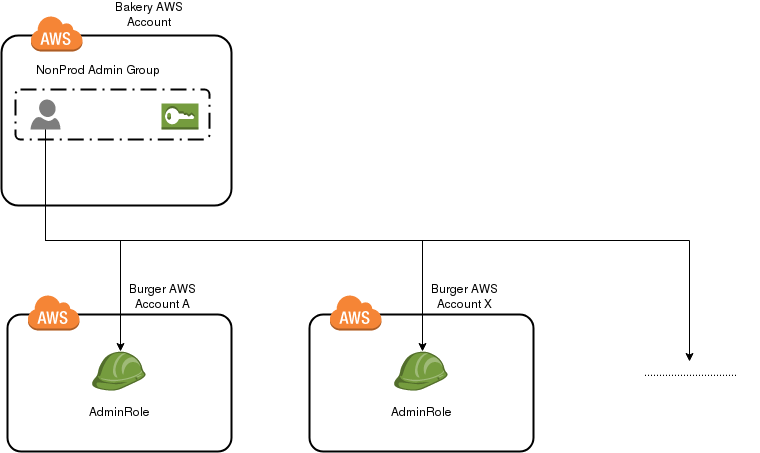
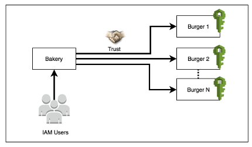

# Bakery and Burgers

Bakery is a centralised AWS identity and access management solution to avoid the duplication of user accounts/policies across multiple AWS accounts. In a nutshell, you just use one AWS account (called Bakery) for managing IAM users and assign right policies to gain access to other AWS account(s) which we call Burgers.

## Terminologies

- Bakery: An AWS Account to manage IAM Users and Groups.
- Burger: An AWS Account where Bakery Users federate into.
- AccessType: Level of access. Defaults are 'Admin', 'PowerUser', 'ReadOnly'.
- Environment Groups:
  - These are AWS IAM Groups designated for each environment type. Defaults are 'Prod', 'NonProd', 'Mgmt' (aka Management)
  - Environment Groups use 'AccessType' for defining different level of access while forming IAM groups.

## Key Concepts

- IAM Users and IAM Groups are created ONLY in Bakery Account
- IAM Users are members of IAM Groups created in same Bakery Account
- Bakery Account manages various privileged access to Burger Accounts
- IAM policies assigned to IAM Group grants AssumeRole access to associated Burger Role

## Architectural overview



As mentioned in the diagram above

- The `NonProd Admin Group` is a [Bakery Environment Group](#bakery-environment-groups). A Bakery Environment Group is composed of an IAM Group and a STS Policy that is assigned to the group. The STS Policy gives privilege to assume AdminRole.
- In this example any member in `NonProd Admin Group` can assume AdminRole in any Burger Account that belongs to NonProd Environment Group.

## How it works

Bakery and Burger implementation is nothing but a process of delegating right level of access across multiple AWS accounts as mentioned in this [AWS documentation](https://docs.aws.amazon.com/IAM/latest/UserGuide/tutorial_cross-account-with-roles.html).

Below are a few key steps which explains the workflow of Bakery

1. Firstly, a trust between two AWS accounts i.e. Bakery & Burgers is created. This process involves creation of IAM access policies & IAM roles.



2. IAM users get created in Bakery account with right level of access. The users can then download AWS access keys from Bakery account.


3. Using downloaded AWS credentials, IAM users can assume relevant role in Burger account.


## Quickstart

1. Modify configuration/config.yml by adding the data relevant to you. Refer to config [README](configuration/README.md) for more information.
2. Setup Bakery AWS account
    1. Ensure your Bakery AWS account's credentials are within the AWS_ACCESS_KEY_ID and AWS_SECRET_ACCESS_KEY environment variables
    2. Run the following commands from the root of the repo

    ```bash
    $ export bakery_cf_bucket=<Name of your S3 bucket>  # Must be already created in your Bakery Account

    $ make deploy-bakery-cf-in-docker
    ```

    This process will dynamically create CloudFormation templates and then deploy IAM groups along with policies using the newly created CloudFormation templates.
3. Setup Burger AWS account

    The below steps need to be run for each Burger account you want to assume roles into.

    1. Ensure your Burger AWS account's credentials are within the AWS_ACCESS_KEY_ID and AWS_SECRET_ACCESS_KEY environment variables
    2. Run following commands from the root of the repo

    ```bash
    $ export account_name=<Name of your burger account>  # E.g. TestAccount

    $ export aws_env=<Environment of your burger account>  # E.g. NonProd

    $ make deploy-burger-cf-in-docker
    ```

    This process will dynamically create a CloudFormation template and then deploy IAM roles using the newly created CloudFormation template.

4. Create IAM Users in Bakery and grant appropriate access
    1. This is a manual process of creating IAM users in your Bakery AWS Account
    2. Once desired IAM users are created, you must associate them to designated [Environment Groups](#bakery-environment-groups) so that they get appropriate access level while assuming a role into Burger AWS Accounts

## Bakery Environment Groups

Bakery Environment Groups (or Environments) are AWS account groupings. We group accounts depending on workloads, security requirements or account classification.
Each group will have AssumeRole access to ```Access Type``` Roles in Burger Accounts.

Default Bakery Environment Groups:
* NonProd
* Prod
* Mgmt

## Access Types

Access Types are types of access that a user can assume.

Default Access Types:
* Admin
* PowerUser
* ReadOnly

## CloudFormation Templates

### Bakery

- Has tmpl files which are used to create the CloudFormation templates using config.yml for the source information
- **bakery_stack** is the main stack that calls `bakery_account` and `bakery_env` nested stacks mentioned below
- **bakery_account** is a nested stack created by **bakery_stack** which creates `AdminGroup` and `UserGroup` for managing Bakery Account
- **bakery_env** is a nested stack created by **bakery_stack** which creates IAM Groups and IAM Policies according to Bakery Environment Groups and Access Types.
  - IAM User that belongs to the IAM Group will have Access Type privileges to Burger Accounts in the Bakery Environment Groups

### Burger

- Has a tmpl file which is used to create the CloudFormation template using config.yml for the source information
- **burger_account** stack is deployed to each Burger account you want to onboard. By default, it creates three IAM roles in Burger account, i.e. AdminRole, PowerUserRole and ReadOnlyRole.

## Customizability and Scalability

We can scale the solution in three directions

- Adding Bakery Environment Groups
- Adding Burger Accounts
- Adding Access Types

# Check Admin Access

Please view [README](deploy_cloudformation/check_admin_access/README.md) for for more information regarding Check Admin Access.

# Utils

Please view [README](utils/README.md) for command line helper tool to assume roles in burger accounts.
