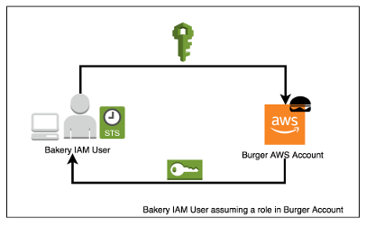

# Bakery and Burgers

Bakery is a centralised AWS identity and access management solution to avoid the duplication of user accounts/policies across multiple AWS accounts. In a nutshell, you just use one AWS account (called Bakery) for managing IAM users and assign right policies to gain access to other AWS account(s) which we call Burgers.

### Terminologies

- Bakery: An AWS Account to manage IAM Users and Groups.
- Burger: An AWS Account where Bakery Users federate into.
- AccessType: Level of access. Defaults are 'Admin', 'PowerUser', 'ReadOnly'
- Environment Groups:
  - These are AWS IAM Groups designated for each environment type. Defaults are 'Prod', 'PreProd', 'Mgmt' (aka Management)
  - Environment Groups uses 'AccessType' for defining different level of access while forming IAM groups.

### Key Concepts

- IAM Users and IAM Groups are created ONLY in Bakery Account
- IAM Users are members of IAM Groups created in same Bakery Account
- Bakery Account manages various privileged access to Burger Accounts
- IAM policies assigned to IAM Group grants AssumeRole access to associated Burger Role

## Architectural overview


As per mentioned in the diagram above

- The `NonProd Admin Group` is a [Bakery Environment Group](#bakery-environment-groups), a Bakery Environment Group is composed of an IAM Group and a STS Policy that is assigned to the group. The STS Policy gives privilege to assume AdminRole.
- In this example any member in `NonProd Admin Group` can assume AdminRole in any Burger Account that belongs to NonProd Environment Group.
- We can customize and scale accordingly. For more details regarding customizing Bakery, please refer 'Customizing Bakery' section in [deploy_cloudformation/bakery/README.md](deploy_cloudformation/bakery/README.md#customizing-bakery)

## How it works

Bakery and Burger implementation is nothing but a process of delegating right level of access across multiple AWS accounts as mentioned in this [AWS documentation](https://docs.aws.amazon.com/IAM/latest/UserGuide/tutorial_cross-account-with-roles.html).

Below are few key steps which explains the workflow of Bakery

1. Firstly, a trust between two AWS accounts i.e. Bakery & Burgers is created. This process involves creation of IAM access policies & IAM roles.


2. IAM users get created in Bakery account with right level of access. The users can then download AWS access keys from Bakery account.


3. Using downloaded AWS credentials, IAM users can assume relevant role in Burger account.



# Quickstart

1. Setup Burger AWS account.
  1.1. Manually [deploy cloudformation template](https://docs.aws.amazon.com/AWSCloudFormation/latest/UserGuide/cfn-using-console.html) `deploy_cloudformation/burger/burger_account.yml` to your burger accounts using AWS Management Console. You can refer [Burger Documentation](deploy_cloudformation/burger/README.md) for detailed instructions on this template as well as deployment procedure.
2. Setup Bakery AWS account (please refer [Bakery Documentation](deploy_cloudformation/bakery/README.md) for detailed instructions).
  2.1. Add your Bakery AWS account's access credentials in `~/.aws/credentials` file
  2.2. Run following commands from the root of the repo.

    ```bash
    $ export bakery_cf_bucket=NameOfYourS3Bucket #Must be already created in your Bakery Account
    $ make deploy-bakery-cf-in-docker
    ```

    This process will deploy few IAM groups along with policies as per specified in the templates inside `deploy_cloudformation/bakery/` and `deploy_cloudformation/burger/`
3. Create IAM Users in Bakery and grant appropriate access.
  3.1. This is a manual process of creating IAM users into your Bakery AWS Account.
  3.2. Once desired IAM users are created, you must associate them to designated [Environment Groups](#terminologies) so that they get appropriate access level while assuming a role into Burger AWS Accounts.

## Cloudformation Templates

### (1) Bakery

- **bakery_stack** is the main stack that calls `bakery_account` and multiple `bakery_env` nested stacks mentioned below.
- **bakery_account** is a nested stack created by **bakery_stack** which creates `AdminGroup` and `UserGroup` for managing Bakery Account.
- **bakery_env** is a nested stack created by **bakery_stack** which creates IAM Groups and IAM Policies according to Bakery Environment Groups and Access Types.
  - IAM User that belongs to the IAM Group will have Access Type privileges to Burger Accounts in the Bakery Environment Groups.
  - By default we create a stack per Environment/Access Type combination 9 stacks in total. `(NonProd, Prod, Mgmt) X (Admin, PowerUser, ReadOnly)`

Please refer [Bakery Documentation](deploy_cloudformation/bakery/README.md) for more details regarding these stacks and customizing them as per your needs.

### (2) Burger

- **burger_account** stack is deployed manually to each Burger account you want to onboard. By default it creates three IAM roles in Burger account i.e. AdminRole, PowerUserRole and ReadOnlyRole.

Please refer [Burger Documentation](deploy_cloudformation/burger/README.md) for more details regarding this stack and customizing it as per your needs.

## Customizability and Scalability

We can scale the solution in three directions

- [Adding Burger Accounts](deploy_cloudformation/bakery/README.md#)
- [Adding Bakery Environment Groups](deploy_cloudformation/bakery/README.md#)
- [Adding Access Types](deploy_cloudformation/bakery/README.md#)

## Utils

Please view [README](utils/README.md) for command line helper tool to assume roles in burger accounts
